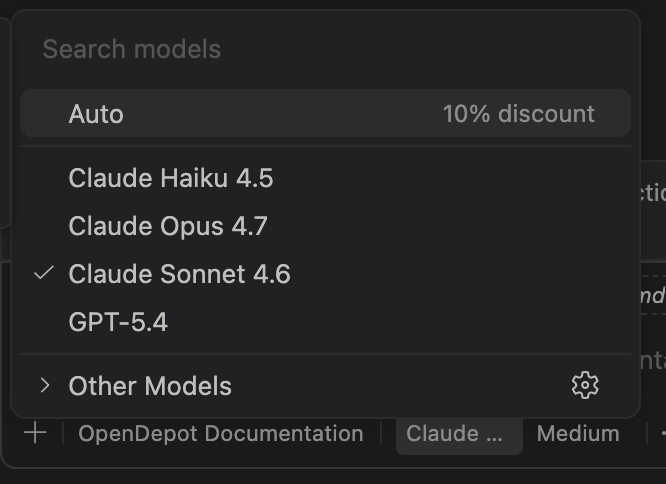
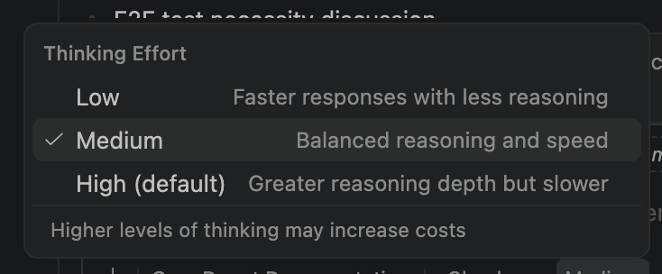
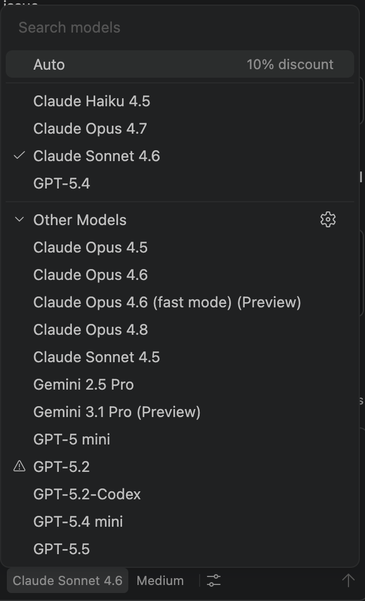

It's 5:44 PM PT exactly as I write this. I was watching the clock today—like a hawk—to see how the new GitHub Copilot AI credits were going to look, and boy, was I surprised. Here are my first impressions.

## Credits Go by Fast
The first thing I did at 5:05 PM PT was ask Claude Sonnet 4.6 a troubleshooting question I was running into with a `makefile`. Nothing major, the usual:

> "I'm just being lazy right now, please fix it virtual tech bro!"

Well, it turns out my `virtual tech bro` is trying to join the `tres commas` club, and in true *Russ Hanneman* fashion, every chain-of-thought, every tool call, and every file read/write was eating into those sweet, sweet credits.

When Claude finally returned an answer to a very basic problem, I had already burned through `61` credits of my `7,000` monthly budget. That's a ton of usage for not a lot of gain.

## New VS Code Changes

### Adjustable Thinking Levels
The one nice change is the ability to adjust the level of thinking across models. This used to be available in the early days, but they removed it in favor of hardcoding specific thinking modes. Claude Sonnet 4.6 (High), my favorite workhorse in the stable, is no longer locked to a single mode:

Now you can switch to a thinking mode that works best for your situation. I'm already dropping mine down to `Medium` in hopes of reducing AI credit consumption:

### Changes to the Model Lineup
The freebie models are gone. The days of having `GPT-4o mini` available for zero tokens are over. Now, every single available model consumes credits:

### Copilot Max Subscription
You can now upgrade to the Max subscription, which offers `20,000` AI credits a month. Considering how quickly credits vanish for simple tasks, it's worth considering. Like the sane, rational human being that I am, I immediately upgraded the second I saw the burn rate.

> I cannot wait to try an MCP server...

## The Easy Days Might Be Over
This might be the end of the high-flying days I've been experiencing the last few months with GitHub Copilot Plus. Fortunately, I crammed as many features as I could into my projects before the credit system started. I'll miss getting features done without burning through requests, but hey, maybe slowing things down a bit is needed?

> Forget that noise!

## Local Models to the Rescue
I have really been digging `qwen3.6-27B` with `thinking` enabled on `mlx_vlm`. It has been the powerhouse for my `MLOps` project `ferme`, which is currently generating Alpaca pairs to fine-tune a `gemma4` and `qwen2.5-coder` model using `QLorA`. 

My M1 Max 64GB is a tight fit, and its TPS is not the greatest, but once my synthetic seeding is done and I have all these Alpaca pairs, it might be time to repurpose `qwen3.6` for coding tasks and `gemma4` for simple generation and documentation tasks. Sounds like it's time to get serious about integrating `Qwen Code` directly into my VS Code workflow!