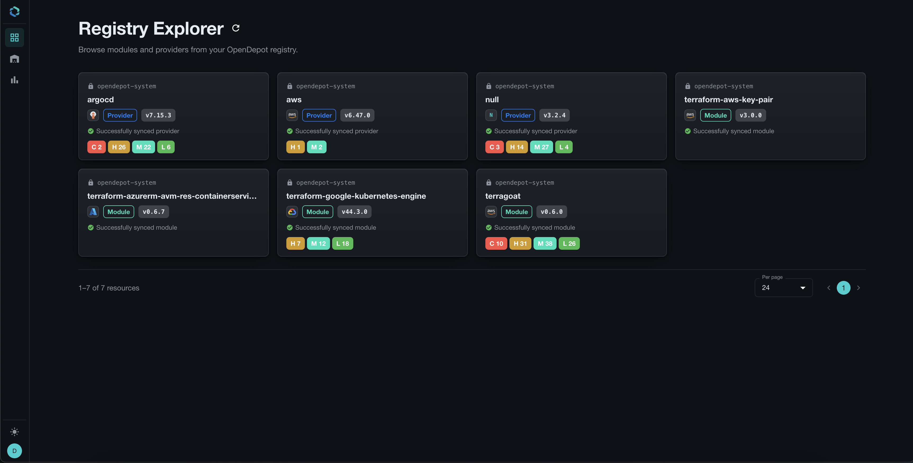
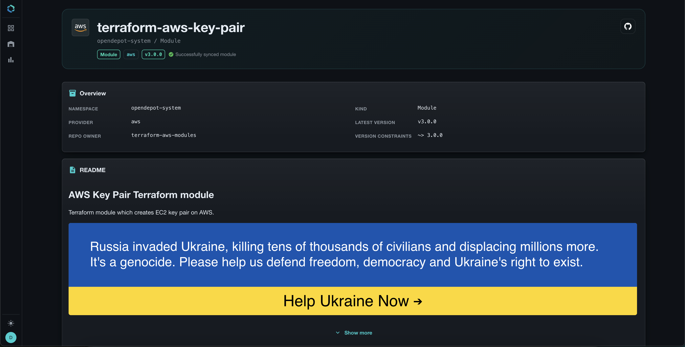
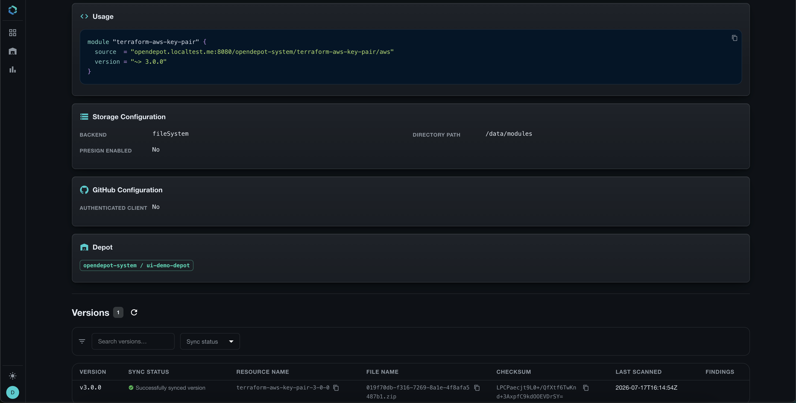
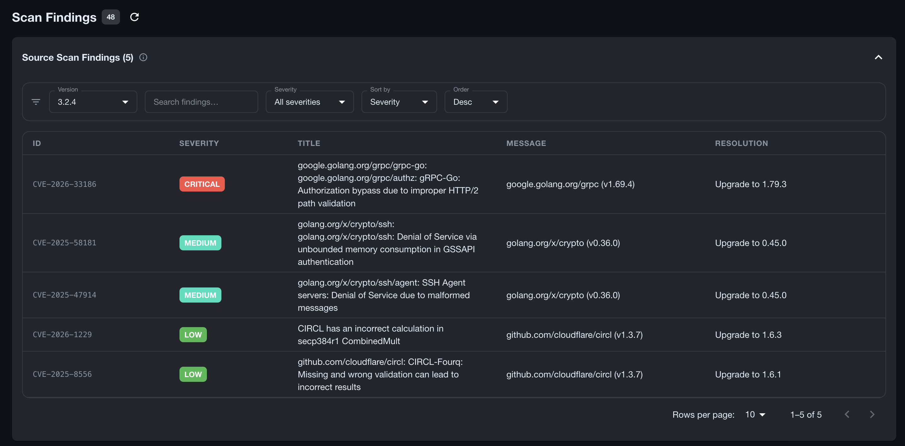
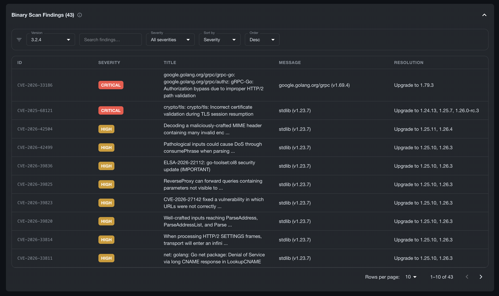
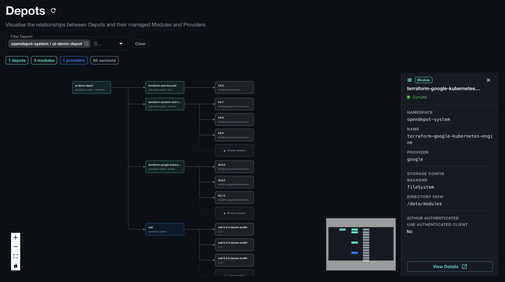
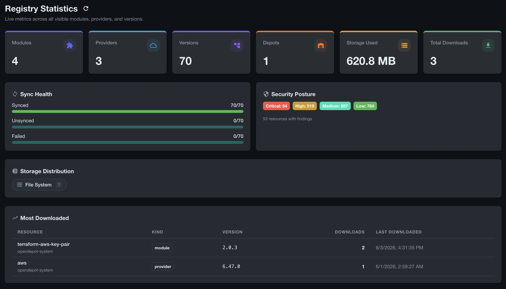
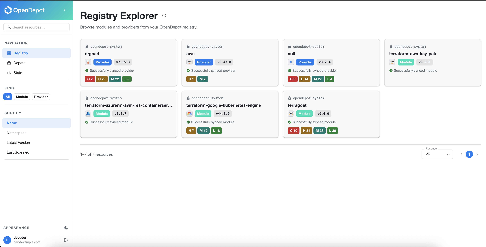

It has been a couple of months since I last provided an update on here about OpenDepot. During that time, I have been working hard to bring new features and quality of life improvements to the project. One of the features I am most excited to share is the Registry Explorer, which is a user interface to view all the resources under management, download and usage stats, and a visual diagram about the relationship between Depots and the resources they manage.

> The shiny things are always the most fun to talk about!

A couple of months ago, I added Dex, an open-source OIDC identity broker, for SSO. It's been long enough now that I want to dig into the story behind it: you can associate group claims in a user's JWT `(JSON Web Token)` with access controls for `Provider` and `Module` resources using the `GroupBinding` resource. In this latest release, I also made some changes to OpenDepot to harden the `Dex` implementation and make it even easier to configure.

> Shout out to the [r/Terraform](https://reddit.com/r/Terraform) community for some of the feedback as it helped shape the future of this project!

These features are now out as part of the `v0.9.0` release, so let's dig into them!

## Registry Explorer

In the beginning, I had envisioned OpenDepot as a flexible solution that would allow Platform Engineers the ability to integrate the data points from OpenDepot into their own IDP `(Internal Developer Portal)` with little effort. However, in working with OpenDepot over the past six months, I realized there's tremendous value in providing out-of-the-box visualizations of resources under its management. Not only does this make development easier, but it rounds out the offering. Teams who don't manage their own IDP can now benefit from the visual representation of the resources managed by OpenDepot. Each resource's visibility is primarily scoped to the user's group claims returned by `Dex`.



> Integrating `Dex` a couple of months ago proved extremely valuable when it came to designing the user interface.

From the landing page, you will find all modules and providers that are currently under management for this instance of OpenDepot. The cards will surface the namespace where the resource is stored, the sync status, the latest version, as well as any vulnerabilities discovered in the latest version's scan.

### Resource Details

Clicking on any card takes you to the version details page where you can drill down into specifics about the module or provider such as an overview, how to use the resource, storage configuration, GitHub configuration, versions table, and vulnerability scans table.

If the resource is a `Module`, the backend controller will try to pull the README from either GitHub or the release archive. If discovered, OpenDepot will store the document in the cluster. A new status field for the `Version` resource was introduced that helps OpenDepot keep track of this new information. This ensures that when a specific `Version` is removed, the associated README is also garbage collected, ensuring no orphaned resources remain in the cluster.


> When the README is rendered by Registry Explorer, any HTML, including `terraform-docs` specific HTML elements, is sanitized to ensure no arbitrary code could potentially be executed in the browser. Additionally, if the README contains examples where a `source = <SOME_SOURCE>` is provided, OpenDepot automatically replaces it with the server's correct `source` field so that users can copy/paste the author's examples without modification.



### Vulnerability Scans
OpenDepot can optionally scan modules and providers for vulnerabilities using `trivy`, an open-source scanner. If there are any vulnerabilities detected, the Registry Explorer will display a table of all findings. The tables are split between source and binary scans. There are numerous filters and search capabilities so that you can find the information that's pivotal in helping you resolve issues.



When `trivy` scans a provider, the binary itself is also scanned. Those findings are displayed under the Binary Scan Findings table.



### Depot

The Depot page helps visualize the relationships between the Depot and its child resources like Modules and Providers. The page allows a user without direct cluster access to watch how their Depots are spinning up new module and provider resources.



### Statistics
The Statistics page provides a number of different data points about the resources under management. Users can use this page to view current storage usage, which types of storage are being used across the stack, download stats, sync health, and more. The `GroupBinding` resource defines which stats are displayed so that any user of OpenDepot is empowered to understand their impact on resource consumption.



### Light Mode
I also added a light mode variant to the Registry Explorer UI to make it more accessible for users and to provide users with styling preferences that suit their tastes.



That wraps up the tour of the new Registry Explorer feature. I hope that you will find it useful as you explore OpenDepot and its capabilities. Let's move on to our deep dive about the new enhancements to `Dex` that should make adopting OpenDepot even easier.

## Dex OIDC SSO Deep Dive
I had first shared this project with a small audience on [dev.to](https://dev.to) and [r/Terraform](https://reddit.com/r/Terraform) to help gain initial feedback. Ultimately, my goal is to make OpenDepot a solution that people in the community want to adopt, so listening to feedback is of great importance to me. One user provided a use-case that I was blind to because it had been a couple of years since I had managed Kubernetes in the way they had described.

### The Problem Statement
In environments where Kubernetes clusters are decentralized, it is a common pattern to have what's called a `Control Plane Cluster`. This type of cluster is used to manage or offer centralized services to dependent clusters. There are many tools out there that provide configurations that help with this style of cluster management. The moment they mentioned it, I immediately recognized the gap. In these scenarios, a system like OpenDepot would ideally be installed as part of the `Control Plane Cluster`. Since OpenDepot only supported Kubernetes RBAC, this meant that users would need to be given some level of access to the `Control Plane Cluster` simply to download modules and providers.

> Yea, that's not ideal. I wouldn't install this myself if my current architecture was set up like that! I admit -- I totally had blinders on, but this is why being open to feedback and criticism can lead to building something even better!

I quickly realized how to solve this since I had implemented many solutions that leveraged SSO to provide access to cloud native systems. That's when I turned to the awesome [CNCF](https://www.cncf.io/projects/dex/) project Dex.

[Dex](https://dexidp.io/) is an open-source identity broker that allows you to set up your IdP `(Identity Provider)` of choice like `Microsoft Entra ID`, `Ping`, `Okta`, `Keycloak`, or any other OIDC `(OpenID Connect)` supported provider to authenticate users and then issue OAuth2 tokens to access applications.

You can configure Dex to emit group claims, which are the primary attributes OpenDepot needed to authorize the resources users would be permitted to access. The additional benefit of adding SSO? Native authentication using either `tofu` or `terraform`. It also fit in nicely with the Registry Explorer to authenticate users.

### The Solution
Integrating Dex alongside OpenDepot was the easy part. The difficult part was wiring everything together so that administrators had the flexibility they needed without making authorization a complicated burden.

I had previously implemented Argo Workflows, the amazing open-source workflow engine, and remembered how it had approached this same problem. They used [Expr](https://expr-lang.org/) expressions that were annotated on Kubernetes Service Accounts to decide whether a specific user was authorized. I decided to implement something similar. However, instead of using Service Account annotations, I approached it by creating a dedicated Custom Resource.

### The GroupBinding Resource
The `GroupBinding` resource allows administrators of OpenDepot to decide which modules and providers users can access. When the server enables `Dex` integration, the `GroupBinding` resources are evaluated in alphabetical order. The first `GroupBinding` resource that allows access to the module or provider being evaluated wins.

Here's an example of a `GroupBinding` resource that allows the `AWS Developers` group access to any module that the glob pattern `terraform-aws-*` matches. This group may only access the single `aws` provider:

```yaml
apiVersion: opendepot.defdev.io/v1alpha1
kind: GroupBinding
metadata:
  name: 02-developer-access
  namespace: opendepot-system
spec:
  expression: '"AWS Developers" in groups'
  moduleResources:
  - terraform-aws-*
  providerResources:
  - aws
```
> The `providerResources` does NOT support globbing except for a solo `*` to indicate *ALL* providers. Most providers have unique names and seldom share similar naming conventions that would make globbing useful.

Here's an example of a `GroupBinding` for administrators that gives access to all resources in OpenDepot:

```yaml
apiVersion: opendepot.defdev.io/v1alpha1
kind: GroupBinding
metadata:
  name: 01-admin-access
  namespace: opendepot-system
spec:
  expression: '"Cloud Administrators" in groups'
  moduleResources:
  - '*'
  providerResources:
  - '*'
```

The primary reason for not using Kubernetes RBAC resources like `Roles` or `ClusterRoles` is that the `resourceNames` field doesn't support extended pattern matching. With `Roles` and `ClusterRoles`, every module would need to be explicitly listed.

Imagine this!

```yaml
  rules:
  - apiGroups:
    - opendepot.defdev.io
    resources:
    - modules
    resourceNames:
    - terraform-aws-key-pair
    - terraform-aws-eks
    - terraform-aws-opensearch
    - terraform-aws-elasticache
    - terraform-aws-secretsmanager
    verbs:
    - get
```

By adding `glob` support to OpenDepot's `GroupBindings`, it is extremely easy to give access to a breadth of similarly named modules.

### The SSO Bonus
I wasn't necessarily trying to solve for it, but adding `Dex` to fix the `Control Plane Cluster` challenge came with an added bonus: `tofu` and `terraform` could use native authentication to gain access to OpenDepot. A team who has installed `Dex` and configured an IdP can have any user easily fetch an access token from OpenDepot by simply using the built-in `tofu login` command. This was made possible by adding the necessary `login.v1` discovery endpoints to the `.well-known/terraform.json` configuration in OpenDepot's server. Additionally, you could leverage the Client Credentials flow for `Machine-to-Machine` authentication.

However, there was one architectural problem when this was first implemented, which was truly a fault of my own. The documentation only implied that the `Dex` server would need an ingress route once deployed outside of a test workstation. Users would have to infer this configuration from clues in the docs. This also meant that not only did you need to expose OpenDepot via an ingress, but `Dex` as well. Now, you had to use two different URLs for authentication to OpenDepot in slightly different contexts. This was not a great user experience.

In the latest release, the OpenDepot server and the UI will natively proxy all `/dex/*` paths to the in-cluster instance of `Dex` by setting the new recommended flag `server.oidc.dexProxy.enabled: true`. The UI and server will transparently proxy requests to `Dex` without modification. Additionally, the OpenDepot server will advertise the same URL for all `tofu` discovery endpoints. In production scenarios where HTTPS will be enabled by default, there is zero extra configuration that needs to be handled to get up and running.

This allows OpenDepot to use a single URL to handle all of `Dex`'s authentication flows needed for the various scenarios one may encounter for `tofu`: `authorization_code`, `client_credentials`, and `device_code`.

Assuming you're running OpenDepot via HTTPS, the native `tofu login` command should work without explicitly configuring `.tofurc` to override the `login.v1` discovery endpoint:

```sh
tofu login opendepot.defdev.io
```

This will initiate the authentication challenge to retrieve an access token by proxying the request through either the OpenDepot server or UI when it's enabled:

```txt
OpenTofu will request an API token for opendepot.defdev.io using OAuth.

This will work only if you are able to use a web browser on this computer to
complete a login process. If not, you must obtain an API token by another
means and configure it in the CLI configuration manually.

If login is successful, OpenTofu will store the token in plain text in
the following file for use by subsequent commands:
    /Users/tonedefdev/.terraform.d/credentials.tfrc.json

Do you want to proceed?
  Only 'yes' will be accepted to confirm.

  Enter a value: yes

OpenTofu must now open a web browser to the login page for opendepot.defdev.io.

If a browser does not open this automatically, open the following URL to proceed:
    https://opendepot.defdev.io/dex/auth?client_id=opendepot&code_challenge=rVCmnR2j-Mm80hjPZ7qR__a7PA7lk-bT0UzELyLec8k&code_challenge_method=S256&redirect_uri=http%3A%2F%2Flocalhost%3A10004%2Flogin&response_type=code&scope=openid+email+profile+groups+offline_access&state=5bd4b9f2-34e9-34a3-a64f-475b8f3197b5
```
> If you do not like the idea of storing access tokens in plain text on a filesystem, you can use my other project [terracreds](https://github.com/tonedefdev/terracreds) to store these credentials in the operating system's credential vault, or in a cloud provider vault like AWS Secrets Manager or HashiCorp Vault.

Once successfully authenticated, you're ready to start fetching modules and providers from OpenDepot!

```txt
Success! OpenTofu has obtained and saved an API token.

The new API token will be used for any future OpenTofu command that must make
authenticated requests to opendepot.defdev.io.
```

### Client Credentials Flow Details
Using `Dex` also provided the ability to use the Client Credentials flow, more commonly known as `Machine-to-Machine` authentication. In this scenario, you prepopulate client credentials in `Dex` so that unattended clients, like those found in CI/CD systems, can fetch access tokens to allow `tofu` to download modules and providers.

This is genuinely useful when solving the challenges for the `Control Plane Cluster` style of Kubernetes management. Now, you can generate all the clients needed for CI/CD systems without ever giving access to anything Kubernetes-related. This also means that the same access request flow works across various cloud providers. Using GitHub Actions with OIDC integration to AWS works flawlessly until you need to do the same thing in Azure or GCP or on-prem. By unifying authentication to a single mechanism, it becomes easier to manage the configuration across different systems.

OpenDepot fully supports this flow by configuring `Dex` to use Client Credentials from the OpenDepot `helm` chart:

```yaml
dex:
  config:
    oauth2:
      grantTypes:
        - authorization_code
        - client_credentials # add this
    staticClients:
      - id: opendepot # default client required
        name: OpenDepot
        secretEnv: OPENDEPOT_DEX_CLIENT_SECRET
        redirectURIs:
          - https://opendepot.defdev.io/auth/callback
      - id: a39ad62f-c5fe-4ff8-b2eb-e07eb2b85ac7 # machine client
        name: CI Pipeline
        secretEnv: OPENDEPOT_CC_CLIENT_SECRET
        grantTypes:
          - client_credentials
  envFrom:
    - secretRef:
        name: opendepot-dex-client-secret # chart default — do not remove
        optional: true
    - secretRef:
        name: opendepot-cc-client-secret # your client credentials secret
```
> It is highly recommended to use UUIDs for Client IDs to ensure that the ID is prohibitively difficult to guess, or memorize by sight alone.

With the credentials defined, `Dex` will be able to authenticate custom clients defined by administrators of the system.

The next step in the process is to enable the OpenDepot server to use Client Credentials and to proxy all `Dex` requests. By default, these settings are turned off:

```yaml
server:
  oidc:
    enabled: true
    allowClientCredentials: true
    dexProxy:
      enabled: true
```

Now, we can create a `GroupBinding` so we can associate the necessary permissions in OpenDepot with our unattended client:

```yaml
apiVersion: opendepot.defdev.io/v1alpha1
kind: GroupBinding
metadata:
  name: ci-pipeline-binding
  namespace: opendepot-system
spec:
  expression: '"client:a39ad62f-c5fe-4ff8-b2eb-e07eb2b85ac7" in groups'
  moduleResources:
    - "*"
  providerResources:
    - "*"
```

The `client` group attribute is added in the Client Credentials scenario since there would be zero groups returned by `Dex`. `Dex` handles this in newer versions of the system with a feature called virtual groups, which are automatically emitted as `client:<CLIENT_ID>` -- formatted the same way as group claims from an IdP -- so downstream systems like `GroupBinding` can use them for authorization decisions.

Once you have the Client Credentials deployed, the pipeline can be configured to:
1. Authenticate the unattended client by exchanging its Client ID and Secret for an access token from `Dex`
2. Receive a JWT in the response with a groups claim attribute that contains a single virtual group `client:<CLIENT_ID>`
3. Export the access token so that `tofu` can use it, and write the `.tofurc` file to point to the OpenDepot server
4. Send the JWT to OpenDepot where the `GroupBinding` will determine if access is granted when `tofu init` is called

```yaml
jobs:
  plan:
    runs-on: ubuntu-latest
    steps:
      - uses: actions/checkout@v4

      - name: Get Dex CC token for OpenDepot registry
        id: opendepot-token
        env:
          CC_CLIENT_ID: ${{ secrets.OPENDEPOT_CC_CLIENT_ID }}
          CC_CLIENT_SECRET: ${{ secrets.OPENDEPOT_CC_CLIENT_SECRET }}
        run: |
          TOKEN=$(curl -sf -X POST https://opendepot.defdev.io/dex/token \
            -d grant_type=client_credentials \
            -d client_id=${CC_CLIENT_ID} \
            -d "client_secret=${CC_CLIENT_SECRET}" \
            -d scope=openid \
            | jq -r '.access_token')
          echo "token=$TOKEN" >> "$GITHUB_OUTPUT"

      - name: Write .tofurc
        run: |
          export TF_TOKEN_OPENDEPOT_DEFDEV_IO="${{ steps.opendepot-token.outputs.token }}"
          cat > ~/.tofurc <<EOF
          host "opendepot.defdev.io" {
            services = {
              "modules.v1" = "https://opendepot.defdev.io/opendepot/modules/v1/"
              "providers.v1" = "https://opendepot.defdev.io/opendepot/providers/v1/"
            }
          }
          EOF

      - name: Setup OpenTofu
        uses: opentofu/setup-opentofu@v1

      - run: tofu init
```

I hope this makes it easier to configure these types of flows so that teams who build large-scale systems using the `Control Plane Cluster` architecture can rest easy knowing that they're giving as few privileges as necessary to access the resources in OpenDepot.

## Conclusion
This concludes the walkthrough of the new features that have been added to OpenDepot since I last wrote about it two months ago. I'm excited to share these new additions, and I continue to look for valuable feedback from users and the community at large.

If you have any questions, comments, feedback, or new feature ideas, I'd love to hear from you! Please feel free to leave comments on this thread or head on over to [OpenDepot](https://github.com/tonedefdev/opendepot) and open an issue!

---

- [Registry Explorer Guide](https://tonedefdev.github.io/opendepot/guides/registry-explorer/) - A guide to walk through the architecture and specific configuration details for the Registry Explorer.
- [OIDC Authentication (Dex)](https://tonedefdev.github.io/opendepot/configuration/oidc/) - A detailed guide on how to configure Dex for use with OpenDepot.
- [Full Documentation](https://tonedefdev.github.io/opendepot/) - Everything you need to get set up, configured, and running your own registry.